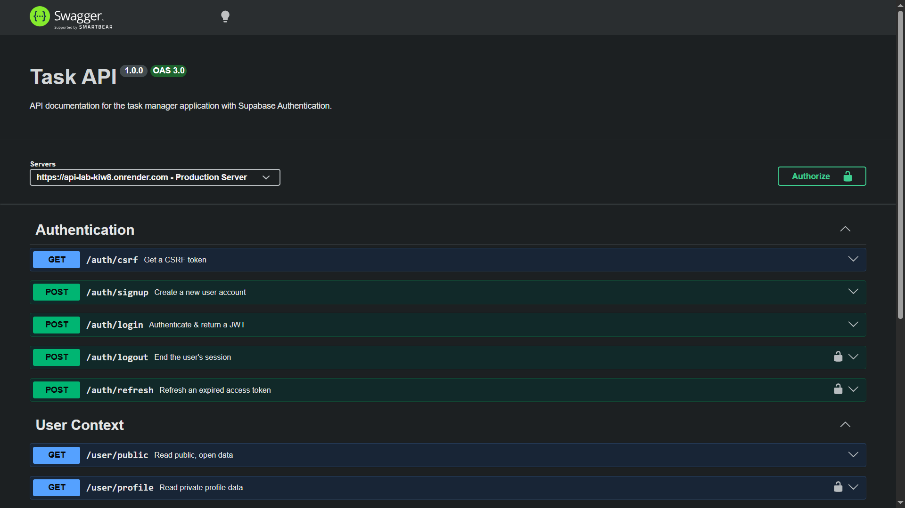
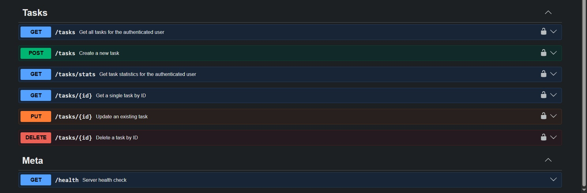

# Task Manager API

A production-grade RESTful API built with **Node.js** and **Express.js** for managing user-scoped tasks. Features full CRUD operations, **Supabase** authentication, **CSRF** protection, **Redis** token blacklisting, **PgBouncer** connection pooling, and interactive **Swagger UI** documentation.

---

## What This Is

This project is a modular Task Management backend service designed to handle task lifecycles securely and efficiently. Every task is scoped to the authenticated user — users can only create, read, update, and delete their own tasks. The system features structured error handling, strict ID validation, CSRF double-submit cookie protection, JWT-based authentication with Redis-backed token blacklisting, and an interactive documentation interface via Swagger UI.

---

## Tech Stack

| Layer               | Technology                           |
| :------------------ | :----------------------------------- |
| **Runtime**         | Node.js 24                           |
| **Framework**       | Express.js 5                         |
| **Database**        | PostgreSQL 18                        |
| **Connection Pool** | PgBouncer (transaction multiplexing) |
| **Cache**           | Redis 8 (token blacklisting)         |
| **Auth Provider**   | Supabase Auth (JWT)                  |
| **CSRF**            | Signed Double-Submit Cookie          |
| **Docs**            | Swagger UI (OpenAPI 3.0)             |
| **Containerization**| Docker Compose                       |

---

## Installation & Running

Ensure you have **Docker** and **Docker Compose** installed on your system. This application is fully containerized. Run the following commands to cleanly build the images and start the entire architecture (Node.js API, PgBouncer, PostgreSQL, and Redis) in the background:

```bash
# Compile the multi-stage images without using the cache for absolute determinism
docker-compose build --no-cache

# Start the container infrastructure in detached mode
docker-compose up -d
```

---

## Authentication Flow

This API uses a cookie-based authentication system with CSRF protection:

1. **Sign Up** — `POST /auth/signup` creates a new user account (no CSRF token needed).
2. **Log In** — `POST /auth/login` authenticates the user and sets three cookies:
   - `access_token` (httpOnly) — JWT for authenticating requests
   - `refresh_token` (httpOnly) — Long-lived token for session renewal
   - `csrf_token` (readable by JS) — CSRF protection token
3. **Make Requests** — All state-changing requests (`POST`, `PUT`, `DELETE`) require the `x-csrf-token` header to match the `csrf_token` cookie.
4. **Log Out** — `POST /auth/logout` blacklists the access token in Redis and clears all cookies.

> **Note:** Swagger UI automatically injects the CSRF token from cookies via a built-in request interceptor — no manual copy-paste needed.

---

## API Endpoints Reference

### Authentication

| Method   | Endpoint        | Description                            | Auth Required | CSRF Required |
| :------- | :-------------- | :------------------------------------- | :-----------: | :-----------: |
| **GET**  | `/auth/csrf`    | Get a CSRF token (sets cookie)         | No            | No            |
| **POST** | `/auth/signup`  | Create a user account                  | No            | No            |
| **POST** | `/auth/login`   | Authenticate & set session cookies     | No            | No            |
| **POST** | `/auth/logout`  | Revoke session (Redis blacklist)       | Yes           | Yes           |
| **POST** | `/auth/refresh` | Refresh an expired access token        | No            | Yes           |

### User

| Method  | Endpoint        | Description                  | Auth Required | CSRF Required |
| :------ | :-------------- | :--------------------------- | :-----------: | :-----------: |
| **GET** | `/user/public`  | Retrieve public data         | No            | No            |
| **GET** | `/user/profile` | Retrieve authenticated user  | Yes           | No            |

### Tasks (User-Scoped)

All task endpoints require authentication. Each user can only access their own tasks.

| Method     | Endpoint        | Description                       | Auth Required | CSRF Required |
| :--------- | :-------------- | :-------------------------------- | :-----------: | :-----------: |
| **GET**    | `/tasks`        | Get all tasks for current user    | Yes           | No            |
| **GET**    | `/tasks/stats`  | Get task statistics for user      | Yes           | No            |
| **GET**    | `/tasks/{id}`   | Get a specific task by ID         | Yes           | No            |
| **POST**   | `/tasks`        | Create a new task                 | Yes           | Yes           |
| **PUT**    | `/tasks/{id}`   | Update an existing task           | Yes           | Yes           |
| **DELETE** | `/tasks/{id}`   | Delete a task by ID               | Yes           | Yes           |

**Query Parameters** for `GET /tasks`:

| Parameter    | Type    | Description                          |
| :----------- | :------ | :----------------------------------- |
| `isComplete` | boolean | Filter tasks by completion status    |
| `search`     | string  | Search tasks by title or description |
| `limit`      | integer | Max number of tasks to return        |
| `offset`     | integer | Number of tasks to skip              |

### Meta

| Method  | Endpoint  | Description          | Auth Required | CSRF Required |
| :------ | :-------- | :------------------- | :-----------: | :-----------: |
| **GET** | `/`       | List API endpoints   | No            | No            |
| **GET** | `/health` | Server health check  | No            | No            |

---

## Database Schema

```sql
CREATE TABLE IF NOT EXISTS tasks (
    id SERIAL PRIMARY KEY,
    user_id UUID NOT NULL REFERENCES auth.users(id) ON DELETE CASCADE,
    title VARCHAR(255) NOT NULL,
    description TEXT,
    is_complete BOOLEAN NOT NULL DEFAULT false,
    created_at TIMESTAMP DEFAULT CURRENT_TIMESTAMP,
    updated_at TIMESTAMP DEFAULT CURRENT_TIMESTAMP
);

CREATE INDEX IF NOT EXISTS idx_tasks_user_id ON tasks(user_id);
```

---

## Project Structure

```
├── server.js                         # Application entry point & bootstrap
├── openapi.json                      # OpenAPI 3.0 specification
├── docker-compose.yml                # Container orchestration
├── Dockerfile                        # Multi-stage build
├── scripts/
│   └── reset.db.js                   # Database reset utility
└── src/
    ├── app.js                        # Express app factory
    ├── config/
    │   ├── database.js               # PostgreSQL connection pool
    │   ├── redis.client.js           # Redis client (dev/prod)
    │   ├── supabase.client.js        # Supabase auth client
    │   └── schema.sql                # Database schema (Docker init)
    ├── controllers/
    │   ├── auth.controller.js        # Signup, login, refresh, CSRF
    │   ├── meta.controller.js        # Health check, API info
    │   ├── task.controller.js        # Task CRUD + stats
    │   └── user.controller.js        # Profile, logout
    ├── middlewares/
    │   ├── authenticate.user.js      # Supabase JWT verification
    │   ├── csrf.middleware.js         # CSRF token generation & validation
    │   └── error.handler.js          # Global error handler (dev/prod)
    ├── repositories/
    │   └── task.repository.js        # SQL queries (user-scoped)
    ├── routes/
    │   ├── auth.routes.js            # /auth/*
    │   ├── meta.routes.js            # /, /health
    │   ├── task.routes.js            # /tasks/* (auth-protected)
    │   └── user.routes.js            # /user/*
    ├── services/
    │   └── task.service.js           # Business logic & validation
    ├── utils/
    │   ├── app.error.js              # Custom AppError class
    │   ├── async.handler.js          # Express async error wrapper
    │   └── swagger.ui.js             # Swagger UI setup + CSRF interceptor
    └── validators/
        ├── auth.validator.js         # Token & credential validation
        ├── env.validator.js          # Environment variable checks
        └── task.params.validator.js  # Task ID validation
```

---

## Database Architecture

This project utilizes [Postgres](https://www.postgresql.org/) as its core relational database management system, interfaced via CLI.

### PostgreSQL & PgBouncer

Transitioning from an embedded database to a robust client-server architecture, this application now utilizes PostgreSQL paired with PgBouncer.

We upgraded to PostgreSQL for its enterprise-grade data integrity and implemented PgBouncer to elegantly handle high-concurrency connection pooling:

- **Containerized Infrastructure:** Deployed via Docker Compose, the database and proxy layers run in isolated, production-identical environments without cluttering the host machine.

- **Transaction Multiplexing:** PgBouncer intercepts lightweight client connections from the Node.js API and shares them across a strict, limited pool of actual PostgreSQL connections. This eliminates memory bottlenecks under high load.

- **Enterprise Standards:** Features strict ACID compliance, a secure fail-fast application bootstrap sequence with strict environment validation, and a standardized snake_case architecture for all database objects.

**Available Commands:**

```
# View live terminal logs for the Node.js API container
docker logs -f task-api-node

# Destroy the containers and wipe the database volume entirely
docker-compose down -v
```

- Use the psql command line inside your terminal to access the virtual PgBouncer administration console for live metrics:

```
# -U admin: Connects as the admin user
# -h task_api_pgbouncer: Targets the PgBouncer container via Docker's internal network
# -p 5432: The internal port PgBouncer is listening on
# pgbouncer: The name of the virtual admin database
docker exec -it task_api_postgres psql -U admin -h task_api_pgbouncer -p 5432 pgbouncer
```

- Execute specialized administration PgBouncer commands.

```
SHOW POOLS; # Displays how many pools exist, how many server connections are currently active, how many are idle, and how many clients are waiting for a connection.

SHOW CLIENTS; # Lists every single active connection from your Node.js application.

SHOW SERVERS; # Lists the actual internal connections PgBouncer currently has open with PostgreSQL.

SHOW STATS; # Displays metrics on total queries processed, network bytes sent/received, and average transaction duration.
```

## Swagger UI Documentation

Access the interactive API documentation interface locally by navigating to `http://localhost:3000/docs/` in your web browser.



