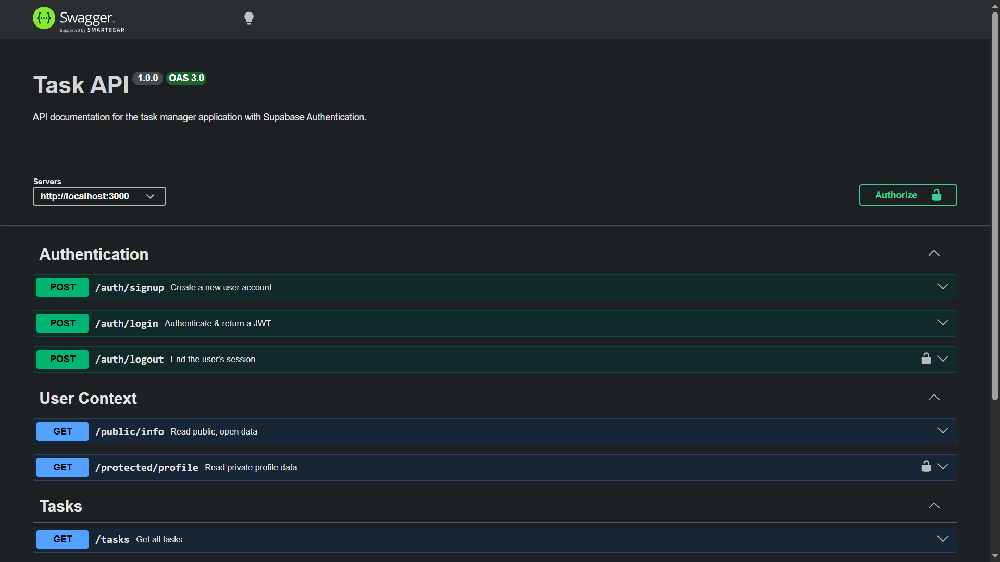
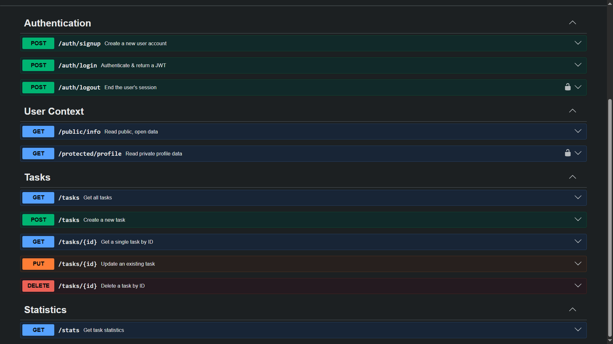

# Task Manager API

A robust RESTful API built with **Node.js** and **Express.js** for managing tasks, complete with full CRUD operations, input validation, and interactive **Swagger UI** documentation.

---

## What This Is

This project is a modular Task Management backend service designed to handle task lifecycles securely and efficiently. It features structured error handling, strict ID validation, dynamic ID incrementation, and an interactive documentation interface via Swagger UI.

---

## Installation & Running

Ensure you have **Docker** and **Docker Compose** installed on your system. This application is fully containerized. Run the following commands to cleanly build the images and start the entire architecture (Node.js API, PgBouncer, and PostgreSQL) in the background:

```bash
# Compile the multi-stage images without using the cache for absolute determinism
docker-compose build --no-cache

# Start the container infrastructure in detached mode
docker-compose up -d
```

---

## API Endpoints Reference

| Method     | Endpoint       | Description                             | Request Body / Parameters                                           | Success Status   |
| :--------- | :------------- | :-------------------------------------- | :------------------------------------------------------------------ | :--------------- |
| **POST**   | `/auth/signup` | Create a user account                   | Email, password                                                     | `201 Created`    |
| **POST**   | `/auth/login`  | Get access, refresh tokens              | Email, password                                                     | `200 OK`         |
| **POST**   | `/auth/logout` | Blacklist (Redis) Revoked access tokens | Authorization Header - Access Token                                 | `204 No Content` |
| **GET**    | `/tasks`       | Retrieve all tasks                      | Optional Queries: limit, offset, search, is_complete                | `200 OK`         |
| **GET**    | `/tasks/{id}`  | Retrieve a specific task by ID          | Path parameter: `id` (integer)                                      | `200 OK`         |
| **GET**    | `/stats`       | Retrieve task statistics                | None                                                                | `200 OK`         |
| **POST**   | `/tasks`       | Create a new task                       | JSON `{ "title": "string" }`                                        | `201 Created`    |
| **PUT**    | `/tasks/{id}`  | Update an existing task                 | Path parameter: `id`, JSON `{ "title": "string", "done": boolean }` | `200 OK`         |
| **DELETE** | `/tasks/{id}`  | Delete a task by ID                     | Path parameter: `id` (integer)                                      | `200 OK`         |

---

## Sample Request (`curl -i`)

Below is a sample terminal execution demonstrating a `GET` request to retrieve all tasks from the API:

```http
HTTP/1.1 200 OK
X-Powered-By: Express
Content-Type: application/json; charset=utf-8
Content-Length: 168
ETag: W/"a8-fTf1n8K0U2V7xZ+9YmQ4vL1e8o4"
Date: Tue, 21 Jul 2026 14:30:00 GMT
Connection: keep-alive

{
  "status": "success",
  "totalCount": 3,
  "data": [
    { "id": 1, "title": "First Assignment", "description": "Task details...", "isComplete": true },
    { "id": 2, "title": "Second Assignment", "description": "Task details...", "isComplete": true },
    { "id": 3, "title": "Third Assignment", "description": "Task details...", "isComplete": false }
  ]
}
```

---

## Database Architecture

This project utilizes [Postgres](https://www.postgresql.org/) as its core relational database management system, interfaced via CLI.

### PostgreSQL & PgBouncer

Transitioning from an embedded database to a robust client-server architecture, this application now utilizes PostgreSQL paired with PgBouncer.

We upgraded to PostgreSQL for its enterprise-grade data integrity and implemented PgBouncer to elegantly handle high-concurrency connection pooling:

- **Containerized Infrastructure:** Deployed via Docker Compose, the database and proxy layers run in isolated, production-identical environments without cluttering the host machine.

- **Transaction Multiplexing:** PgBouncer intercepts lightweight client connections from the Node.js API and shares them across a strict, limited pool of actual PostgreSQL connections. This eliminates memory bottlenecks under high load.

- **Enterprise Standards:** Features strict ACID compliance, a secure fail-fast application bootstrap sequence with strict environment validation, and a standardized snake_case architecture for all database objects.

**Available Commands:**

```
# View live terminal logs for the Node.js API container
docker logs -f task-api-node

# Destroy the containers and wipe the database volume entirely
docker-compose down -v
```

- Use the psql command line inside your terminal to access the virtual PgBouncer administration console for live metrics:

```
# -U admin: Connects as the admin user
# -h task_api_pgbouncer: Targets the PgBouncer container via Docker's internal network
# -p 5432: The internal port PgBouncer is listening on
# pgbouncer: The name of the virtual admin database
docker exec -it task_api_postgres psql -U admin -h task_api_pgbouncer -p 5432 pgbouncer
```

- Execute specialized administration PgBouncer commands.

```
SHOW POOLS; # Displays how many pools exist, how many server connections are currently active, how many are idle, and how many clients are waiting for a connection.

SHOW CLIENTS; # Lists every single active connection from your Node.js application.

SHOW SERVERS; # Lists the actual internal connections PgBouncer currently has open with PostgreSQL.

SHOW STATS; # Displays metrics on total queries processed, network bytes sent/received, and average transaction duration.
```

## Swagger UI Documentation

Access the interactive API documentation interface locally by navigating to `http://localhost:3000/docs/` in your web browser.



