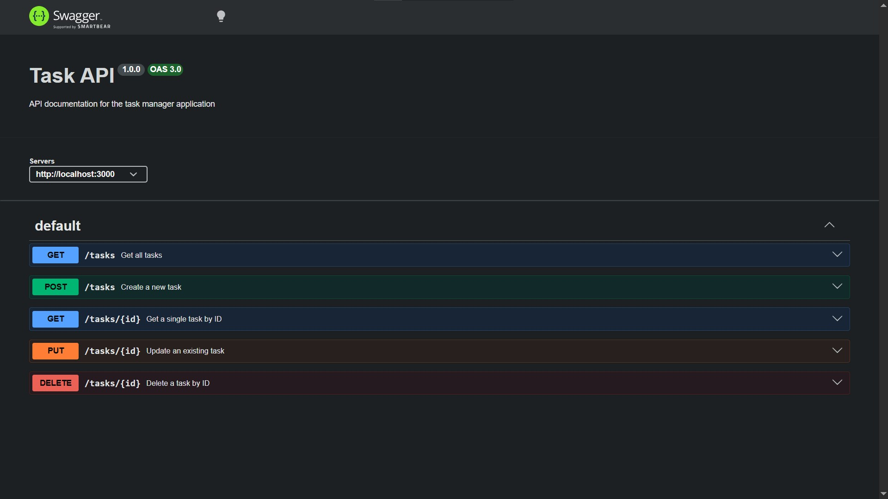

# Task Manager API

A robust RESTful API built with **Node.js** and **Express.js** for managing tasks, complete with full CRUD operations, input validation, and interactive **Swagger UI** documentation.

---

## What This Is

This project is a modular Task Management backend service designed to handle task lifecycles securely and efficiently. It features structured error handling, strict ID validation, dynamic ID incrementation, and an interactive documentation interface via Swagger UI.

---

## Installation & Running

Ensure you have [Node.js](https://nodejs.org/) installed on your system. Run the following single command to install all dependencies and start the server:

```bash
npm install && npm start
```

---

## API Endpoints Reference

| Method     | Endpoint      | Description                    | Request Body / Parameters                                           | Success Status |
| :--------- | :------------ | :----------------------------- | :------------------------------------------------------------------ | :------------- |
| **GET**    | `/tasks`      | Retrieve all tasks             | None                                                                | `200 OK`       |
| **GET**    | `/tasks/{id}` | Retrieve a specific task by ID | Path parameter: `id` (integer)                                      | `200 OK`       |
| **POST**   | `/tasks`      | Create a new task              | JSON `{ "title": "string" }`                                        | `201 Created`  |
| **PUT**    | `/tasks/{id}` | Update an existing task        | Path parameter: `id`, JSON `{ "title": "string", "done": boolean }` | `200 OK`       |
| **DELETE** | `/tasks/{id}` | Delete a task by ID            | Path parameter: `id` (integer)                                      | `200 OK`       |

---

## Sample Request (`curl -i`)

Below is a sample terminal execution demonstrating a `GET` request to retrieve all tasks from the API:

```http
HTTP/1.1 200 OK
X-Powered-By: Express
Content-Type: application/json; charset=utf-8
Content-Length: 168
ETag: W/"a8-fTf1n8K0U2V7xZ+9YmQ4vL1e8o4"
Date: Tue, 21 Jul 2026 14:30:00 GMT
Connection: keep-alive

{
  "status": "success",
  "totalCount": 3,
  "tasks": [
    { "id": 1, "title": "First Assignment", "done": true },
    { "id": 2, "title": "Second Assignment", "done": true },
    { "id": 3, "title": "Third Assignment", "done": false }
  ]
}
```

---

## Swagger UI Documentation

Access the interactive API documentation interface locally by navigating to `http://localhost:3000/docs` in your web browser.


